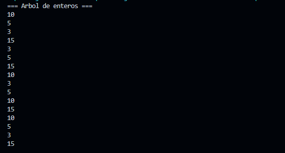
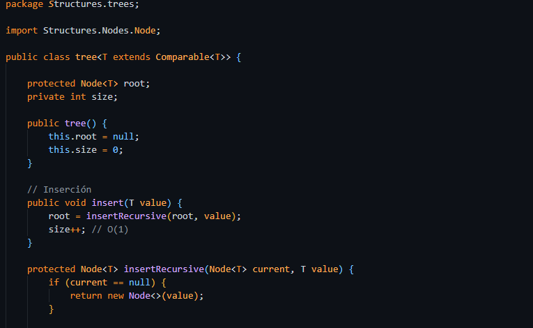
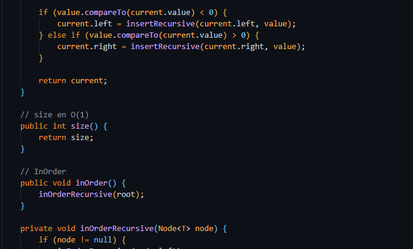
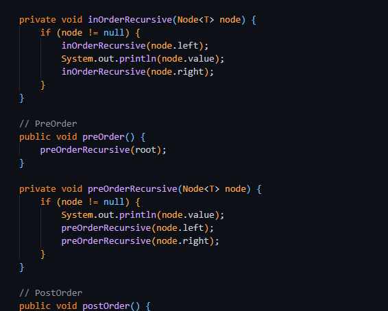
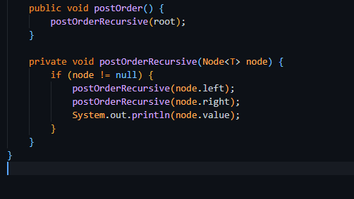
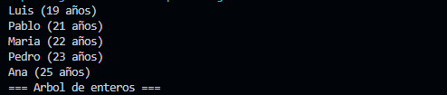

# Práctica: Estructuras No Lineales - 

## Autor
- Nombre: Juan Andres Tenesaca Criollo
- Carrera/Curso: Estructuras De Datos

##  Nombre de la práctica - Fecha
- Práctica: Práctica de Árboles – Implementación Integers
- Fecha: [5/1/2026]

## Descripción
# Árbol Binario de Búsqueda en Java

En esta práctica se desarrolló un **Árbol Binario de Búsqueda (BST)** utilizando el lenguaje de programación **Java**, aplicando los principios de la **Programación Orientada a Objetos (POO)** y el uso de **clases genéricas**.  
La implementación permite almacenar elementos de cualquier tipo siempre que implementen la interfaz `Comparable`, garantizando el orden correcto de los datos dentro del árbol.

El proyecto incluye operaciones fundamentales como la **inserción de nodos**, el cálculo del **tamaño del árbol en tiempo constante O(1)** mediante un contador interno, y los **recorridos recursivos InOrder, PreOrder y PostOrder**.  
Además, el código se organizó en paquetes para mejorar la **modularidad, legibilidad y reutilización**.

---

## Estructura del Proyecto


## Evidencias
### Captura 1



### Captura 2 






## Descripción
## Prueba del Árbol Binario con Objetos Persona

En esta sección se valida el funcionamiento del Árbol Binario de Búsqueda utilizando objetos de tipo `Persona`.  
Cada objeto implementa la interfaz `Comparable`, permitiendo ordenar automáticamente los nodos según la edad.

### Código de prueba

```java
personaTree.insert(new Persona("Ana", 25));
personaTree.insert(new Persona("Luis", 20));
personaTree.insert(new Persona("Carlos", 30));
personaTree.insert(new Persona("María", 22));

personaTree.inOrder();
```

## Evidencias
### Captura 1

### Captura 2 


